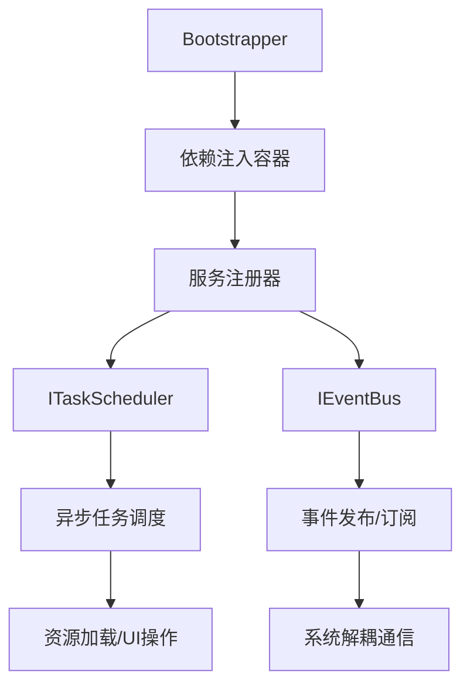

# TradeGame 框架深度解析与使用指南

## 1. 框架概述

TradeGame 框架是一个基于 **VContainer（依赖注入）**、**UniRx（响应式编程）** 和 **UniTask（异步任务）** 构建的模块化游戏框架，专为模拟经营、跑商、角色养成等类型游戏设计。框架位于 `Assets/Scripts/Runtime/Framework` 目录下，包含三个核心模块：

1. **依赖注入（DependencyInjection）** – 统一管理服务生命周期
2. **异步任务（Async）** – 高性能任务调度与跟踪
3. **响应式事件（Reactive）** – 事件驱动的系统通信



## 2. 依赖注入模块

### 2.1 核心组件

#### `Bootstrapper` (`Assets/Scripts/Runtime/Framework/DependencyInjection/Bootstrapper.cs`)
**作用**：容器引导程序，继承自 VContainer 的 `LifetimeScope`，负责初始化全局容器并注册框架核心服务。

**关键字段**：
- `manualRegistrations` – 手动注册的服务列表（可在 Inspector 中配置）
- `_serviceRegistrars` – 手动配置的 `IServiceRegistrar` 组件列表
- `_additionalInstallers` – 自定义 VContainer `IInstaller` 组件列表

**关键方法**：
- `protected override void Configure(IContainerBuilder builder)` – 核心配置入口，调用三个注册阶段
- `RegisterFrameworkServices` – 注册框架内置服务（事件总线、任务调度器、存档、资源等）
- `RegisterManualServices` – 注册手动配置的服务
- `InvokeServiceRegistrars` – 调用 `IServiceRegistrar` 组件进行模块化注册
- `public new void Build()` – 手动构建容器（当基类 `autoRun` 为 false 时使用）

**静态访问方法**：
- `public static T Resolve<T>()` – 全局解析服务
- `public static bool TryResolve<T>(out T service)` – 尝试解析服务

**使用示例**：
```csharp
// 场景中挂载 Bootstrapper 组件，Inspector 中配置 autoRun 为 true（基类提供）
// 手动构建（如果需要延迟初始化）
Bootstrapper bootstrapper = FindObjectOfType<Bootstrapper>();
bootstrapper.Build();

// 解析服务
IEventBus eventBus = Bootstrapper.Resolve<IEventBus>();
```

#### `IServiceRegistrar` (`Assets/Scripts/Runtime/Framework/DependencyInjection/IServiceRegistrar.cs`)
**作用**：服务注册器接口，允许模块化注册服务。

**接口定义**：
```csharp
public interface IServiceRegistrar
{
    void RegisterServices(IContainerBuilder builder);
}
```

**实现示例**：
```csharp
public class SaveServiceRegistrar : MonoBehaviour, IServiceRegistrar
{
    public void RegisterServices(IContainerBuilder builder)
    {
        builder.Register<SaveService>(Lifetime.Singleton).As<ISaveService>();
    }
}
```

**注册方式**：
1. 在 `Bootstrapper` 的 `_serviceRegistrars` 列表中拖入该 MonoBehaviour
2. 或由框架自动查找场景中所有 `IServiceRegistrar` 组件（当 `_serviceRegistrars` 为空时）

### 2.2 依赖注入最佳实践

1. **构造函数注入**：所有服务都应通过构造函数注入，避免使用 `Bootstrapper.Resolve<T>()` 静态方法（仅在无法注入的 MonoBehaviour 中使用）。
2. **生命周期管理**：
   - `Singleton`：全局单例，整个应用生命周期存在
   - `Scoped`：每个容器作用域一个实例（如每个场景）
   - `Transient`：每次解析创建新实例
3. **循环依赖**：避免循环依赖，若无法避免，使用 `Lazy<T>` 或 `Func<T>` 包装。

## 3. 异步任务模块

### 3.1 核心接口与类

#### `ITaskScheduler` (`Assets/Scripts/Runtime/Framework/Async/ITaskScheduler.cs`)
**作用**：异步任务调度器接口，提供任务执行、取消、等待等功能。

**API 文档**：
| 方法 | 说明 |
|------|------|
| `UniTask Run(Func<CancellationToken, UniTask> taskFactory, string taskName = null, CancellationToken cancellationToken = default)` | 执行异步任务，返回表示任务完成的 UniTask |
| `int RunWithId(...)` | 执行异步任务，返回任务 ID（用于后续取消） |
| `bool CancelTask(int taskId)` | 取消指定 ID 的任务 |
| `void CancelAll()` | 取消所有任务 |
| `UniTask WaitAll()` | 等待所有活跃任务完成 |
| `int ActiveTaskCount` | 当前活跃任务数量（只读属性） |

#### `TaskScheduler` (`Assets/Scripts/Runtime/Framework/Async/TaskScheduler.cs`)
**作用**：`ITaskScheduler` 的默认实现，基于 UniTask 和 `TrackedTask` 内部类。

**关键特性**：
- **任务跟踪**：每个任务分配唯一 ID，便于管理和取消
- **自动清理**：任务完成后自动从活跃字典移除，避免内存泄漏
- **线程安全**：使用 `lock` 保护共享数据结构
- **全局单例**：提供静态 `Instance` 属性（通过 `[RuntimeInitializeOnLoadMethod]` 初始化）

**内部机制**：
- `_activeTasks`：字典，映射任务 ID 到 `TrackedTask` 实例
- `_completedTasks`：队列，存储已完成的任务（用于批量清理）
- `RemoveTask(int taskId)`：内部方法，供 `TrackedTask` 在完成后调用

#### `TrackedTask` (`Assets/Scripts/Runtime/Framework/Async/TrackedTask.cs`)
**作用**：内部类，封装单个任务的执行状态。

**属性**：
- `Id` – 任务唯一标识
- `Name` – 任务名称（用于调试）
- `LinkedCts` – 关联的 `CancellationTokenSource`
- `CompletionTask` – 表示任务完成的 `UniTask`

**关键方法**：
- `Start(Func<CancellationToken, UniTask> taskFactory)` – 启动任务，处理完成、取消和异常
- `Cancel()` – 取消任务（触发 `CancellationToken`）
- `Dispose()` – 释放 `CancellationTokenSource`

#### `TaskSchedulerExtensions` (`Assets/TradeGame/Scripts/Runtime/Framework/Async/TaskSchedulerExtensions.cs`)
**作用**：为 `ITaskScheduler` 提供便捷扩展方法。

**扩展方法**：
- `RunFireAndForget` – 执行任务并忽略结果（Fire-and-forget 模式）
- `RunDelayed` – 延迟指定时间后执行任务
- `RunSequential` – 顺序执行多个任务（一个接一个）

### 3.2 使用示例

```csharp
// 获取调度器实例（通过依赖注入或静态实例）
ITaskScheduler scheduler = Bootstrapper.Resolve<ITaskScheduler>();
// 或 TaskScheduler.Instance（如果未使用 DI）

// 执行简单任务
UniTask task = scheduler.Run(async ct =>
{
    await UniTask.Delay(1000, cancellationToken: ct);
    Debug.Log("1秒后执行");
}, "延迟任务");

// 执行带 ID 的任务（便于取消）
int taskId = scheduler.RunWithId(async ct =>
{
    await LoadLargeAsset(ct);
}, "资源加载");

// 取消任务
scheduler.CancelTask(taskId);

// 延迟执行
scheduler.RunDelayed(TimeSpan.FromSeconds(2), async ct =>
{
    Debug.Log("2秒后执行");
});

// 顺序执行多个任务
scheduler.RunSequential(new Func<CancellationToken, UniTask>[]
{
    async ct => await LoadConfig(ct),
    async ct => await SetupUI(ct),
    async ct => await StartGame(ct)
});

// 等待所有任务完成
await scheduler.WaitAll();
```

### 3.3 最佳实践

1. **任务命名**：为任务提供有意义的名称，便于调试和日志跟踪。
2. **取消传播**：始终将 `CancellationToken` 传递给内部异步操作，支持协作式取消。
3. **异常处理**：任务内捕获异常并记录，避免任务静默失败。
4. **资源释放**：长时间运行的任务应定期检查 `cancellationToken.IsCancellationRequested` 并及时释放资源。

## 4. 响应式事件模块

### 4.1 核心接口与类

#### `IEventBus` (`Assets/Scripts/Runtime/Framework/Reactive/EventBus.cs`)
**作用**：事件总线接口，基于 UniRx 的发布-订阅模式。

**API 文档**：
| 方法 | 说明 |
|------|------|
| `void Publish<TEvent>(TEvent eventData)` | 发布事件（`TEvent` 必须为 class） |
| `IDisposable Subscribe<TEvent>(Action<TEvent> handler)` | 订阅事件，返回 `IDisposable` 用于取消订阅 |
| `IDisposable Subscribe<TEvent>(Action<TEvent> handler, Func<TEvent, bool> predicate)` | 带条件的订阅 |
| `IObservable<TEvent> AsObservable<TEvent>()` | 获取事件的可观察流（用于高级 Rx 操作） |

#### `EventBus` (`Assets/Scripts/Runtime/Framework/Reactive/EventBus.cs`)
**作用**：`IEventBus` 的默认实现。

**内部机制**：
- `_subjectMap`：字典，映射事件类型到 `Subject<TEvent>`（每个事件类型一个 Subject）
- `_disposables`：`CompositeDisposable`，集中管理所有订阅的生命周期
- `GetSubject<TEvent>()`：获取或创建对应事件的 Subject

**生命周期**：
- 实现 `IDisposable`，调用 `Dispose()` 会清理所有订阅和 Subject。

#### `GameEvent` 与 `GameEvent<TData>`
**作用**：提供强类型事件基类，可携带数据和时间戳。

**使用示例**：
```csharp
// 自定义事件
public class PlayerLevelUpEvent : GameEvent<int>
{
    public PlayerLevelUpEvent(int newLevel) : base(newLevel) { }
}

// 发布
eventBus.Publish(new PlayerLevelUpEvent(10));

// 订阅
eventBus.Subscribe<PlayerLevelUpEvent>(e => Debug.Log($"玩家升级到 {e.Data} 级"));
```

#### `EventBusExtensions`
**作用**：为 `IEventBus` 提供便捷扩展方法，简化带数据事件的发布和订阅。

**扩展方法**：
- `Publish<TData>(TData data, object sender = null)` – 发布带数据的事件（自动包装为 `GameEvent<TData>`）
- `Subscribe<TData>(Action<GameEvent<TData>> handler)` – 订阅带数据的事件
- `Subscribe<TData>(Action<TData> handler)` – 订阅事件并自动解包数据

### 4.2 使用示例

```csharp
// 获取事件总线（通过依赖注入）
IEventBus eventBus = Bootstrapper.Resolve<IEventBus>();

// 发布简单事件
eventBus.Publish("玩家金币变化", 1500);

// 发布强类型事件
eventBus.Publish(new PlayerLevelUpEvent(5));

// 订阅事件（返回 IDisposable，务必管理生命周期）
IDisposable subscription = eventBus.Subscribe<PlayerLevelUpEvent>(e =>
{
    Debug.Log($"玩家升级到 {e.Data} 级");
});

// 带条件的订阅
subscription = eventBus.Subscribe<PlayerLevelUpEvent>(
    e => Debug.Log($"升级到 {e.Data}"),
    e => e.Data > 5
);

// 使用扩展方法订阅（自动解包数据）
subscription = eventBus.Subscribe<int>("玩家金币变化", amount =>
{
    Debug.Log($"金币数量: {amount}");
});

// 取消订阅
subscription.Dispose();

// 使用 Rx 操作符
eventBus.AsObservable<PlayerLevelUpEvent>()
        .Throttle(TimeSpan.FromSeconds(1))
        .Subscribe(e => Debug.Log($"1秒内最新升级: {e.Data}"));
```

### 4.3 最佳实践

1. **订阅管理**：始终保存 `IDisposable` 订阅对象，并在适当时机（如 `OnDestroy`）调用 `Dispose()`，防止内存泄漏。
2. **事件设计**：优先使用小而专的事件，避免庞大、多用途的事件类型。
3. **避免耗时操作**：事件处理函数应快速执行，若需耗时操作，应异步处理并确保线程安全。
4. **使用强类型事件**：继承 `GameEvent` 或 `GameEvent<TData>` 获得类型安全和自动数据封装。

## 5. 完整使用流程示例

### 5.1 初始化框架

1. **场景设置**：在初始场景中创建空 GameObject，添加 `Bootstrapper` 组件。
2. **配置注册器**：在 `Bootstrapper` 的 `_serviceRegistrars` 列表中拖入自定义 `IServiceRegistrar` 组件。
3. **运行场景**：框架自动构建容器并注册所有服务。

### 5.2 创建新模块

假设我们要添加一个“商店系统”：

```csharp
// 1. 定义接口
public interface IShopService
{
    UniTask<bool> PurchaseItem(string itemId, int quantity);
    IObservable<int> OnGoldChanged { get; }
}

// 2. 实现服务
public class ShopService : IShopService
{
    private readonly IEventBus _eventBus;
    private readonly ReactiveProperty<int> _gold = new ReactiveProperty<int>(1000);

    public ShopService(IEventBus eventBus)
    {
        _eventBus = eventBus;
    }

    public async UniTask<bool> PurchaseItem(string itemId, int quantity)
    {
        // 模拟异步购买
        await UniTask.Delay(500);
        _gold.Value -= 10 * quantity;
        _eventBus.Publish("玩家金币变化", _gold.Value);
        return true;
    }

    public IObservable<int> OnGoldChanged => _gold;
}

// 3. 注册服务（通过 IServiceRegistrar）
public class ShopServiceRegistrar : MonoBehaviour, IServiceRegistrar
{
    public void RegisterServices(IContainerBuilder builder)
    {
        builder.Register<ShopService>(Lifetime.Singleton).As<IShopService>();
    }
}

// 4. 在其他系统中使用
public class UIShopPanel : MonoBehaviour
{
    private IShopService _shop;
    private IEventBus _eventBus;
    private CompositeDisposable _disposables = new();

    // 通过构造函数注入（如果 UIShopPanel 由容器创建）
    // 或通过 Bootstrapper.Resolve 获取（对于 MonoBehaviour）
    private void Start()
    {
        _shop = Bootstrapper.Resolve<IShopService>();
        _eventBus = Bootstrapper.Resolve<IEventBus>();

        // 订阅金币变化
        _shop.OnGoldChanged.Subscribe(gold => UpdateGoldUI(gold)).AddTo(_disposables);
        _eventBus.Subscribe<int>("玩家金币变化", gold => Debug.Log($"金币: {gold}")).AddTo(_disposables);
    }

    private void OnDestroy()
    {
        _disposables.Dispose();
    }

    public async void OnPurchaseButtonClicked()
    {
        await _shop.PurchaseItem("sword", 1);
    }
}
```

## 6. 测试方法

### 6.1 单元测试（使用 NUnit + UniTask）

**测试环境搭建**：
1. 在项目中安装 `NUnit`、`UniTask` 测试支持包。
2. 创建 `Tests` 文件夹，添加 `Assembly Definition` 并引用游戏主程序集。

**示例测试**：
```csharp
using NUnit.Framework;
using System.Threading;
using Cysharp.Threading.Tasks;

public class TaskSchedulerTests
{
    private TaskScheduler _scheduler;

    [SetUp]
    public void Setup()
    {
        _scheduler = new TaskScheduler();
    }

    [TearDown]
    public void TearDown()
    {
        _scheduler.Dispose();
    }

    [Test]
    public async UniTask Run_SimpleTask_CompletesSuccessfully()
    {
        bool completed = false;
        await _scheduler.Run(async ct =>
        {
            await UniTask.Delay(100, cancellationToken: ct);
            completed = true;
        });

        Assert.IsTrue(completed);
    }

    [Test]
    public async UniTask CancelTask_TaskIsCancelled()
    {
        bool wasCancelled = false;
        int taskId = _scheduler.RunWithId(async ct =>
        {
            try
            {
                await UniTask.Delay(1000, cancellationToken: ct);
            }
            catch (OperationCanceledException)
            {
                wasCancelled = true;
            }
        });

        await UniTask.Delay(100);
        _scheduler.CancelTask(taskId);
        await UniTask.Delay(200);

        Assert.IsTrue(wasCancelled);
    }
}
```

### 6.2 集成测试（模拟完整流程）

```csharp
using NUnit.Framework;
using UnityEngine;

public class BootstrapperIntegrationTests
{
    private GameObject _bootstrapperGo;

    [SetUp]
    public void Setup()
    {
        _bootstrapperGo = new GameObject("Bootstrapper");
        var bootstrapper = _bootstrapperGo.AddComponent<Bootstrapper>();
        // 手动构建，跳过 autoRun
        bootstrapper.Build();
    }

    [Test]
    public void Resolve_EventBus_ReturnsSingleton()
    {
        var eventBus1 = Bootstrapper.Resolve<IEventBus>();
        var eventBus2 = Bootstrapper.Resolve<IEventBus>();

        Assert.IsNotNull(eventBus1);
        Assert.AreSame(eventBus1, eventBus2);
    }

    [Test]
    public void PublishSubscribe_EventWorks()
    {
        var eventBus = Bootstrapper.Resolve<IEventBus>();
        bool received = false;
        eventBus.Subscribe<string>("TestEvent", data => received = true);

        eventBus.Publish("TestEvent", "Hello");
        Assert.IsTrue(received);
    }

    [TearDown]
    public void TearDown()
    {
        Object.DestroyImmediate(_bootstrapperGo);
    }
}
```

### 6.3 性能测试

```csharp
using System.Diagnostics;
using UnityEngine.Profiling;

public class TaskSchedulerPerformanceTests
{
    [Test]
    public void Run_1000Tasks_CompletesWithinTime()
    {
        var scheduler = new TaskScheduler();
        var stopwatch = Stopwatch.StartNew();

        for (int i = 0; i < 1000; i++)
        {
            scheduler.RunFireAndForget(async ct =>
            {
                await UniTask.Yield();
            });
        }

        scheduler.WaitAll().Forget();
        stopwatch.Stop();

        Assert.Less(stopwatch.ElapsedMilliseconds, 1000);
        scheduler.Dispose();
    }
}
```

## 7. 常见问题排查

| 问题 | 可能原因 | 解决方案 |
|------|----------|----------|
| 容器构建失败 | 循环依赖；未注册的服务被依赖 | 检查注册顺序；使用 `Lazy<T>` 包装；确保所有依赖项已注册 |
| 事件订阅内存泄漏 | 订阅未及时取消 | 使用 `CompositeDisposable` 管理；在 `OnDestroy` 中调用 `Dispose()` |
| 异步任务未执行 | `CancellationToken` 提前取消；任务调度器未初始化 | 检查取消令牌来源；确保 `TaskScheduler.Instance` 已初始化（或通过 DI 获取） |
| 序列化字段冲突 | 子类字段与基类字段同名 | 重命名字段；移除 `[SerializeField]`；使用 `[HideInInspector]` |
| 服务解析为 null | 服务未注册；生命周期不匹配 | 检查 `Bootstrapper.Configure` 中的注册代码；确保解析时机在容器构建之后 |

## 8. 扩展与自定义

### 8.1 添加新的安装器（IInstaller）
VContainer 的 `IInstaller` 允许将一组相关服务封装为一个可重用的安装器。

```csharp
public class AnalyticsInstaller : VContainer.Unity.IInstaller
{
    public void Install(IContainerBuilder builder)
    {
        builder.Register<AnalyticsService>(Lifetime.Singleton).As<IAnalyticsService>();
    }
}

// 在 Bootstrapper 的 _additionalInstallers 列表中配置
```

### 8.2 自定义任务调度策略
继承 `TaskScheduler` 并重写相关方法，可实现优先级调度、任务池等高级功能。

### 8.3 事件总线增强
通过继承 `EventBus` 并重写 `GetSubject` 方法，可以实现事件分类、跨场景事件持久化等高级特性。

## 9. 总结

TradeGame 框架通过 **依赖注入**、**异步任务** 和 **响应式事件** 三大支柱，为游戏开发提供了清晰、模块化、可测试的架构基础。遵循本指南中的最佳实践，您可以快速构建可维护、可扩展的游戏系统。

**下一步建议**：
1. 根据项目需求，在 `Bootstrapper` 中注册更多核心服务（如存档、配置、本地化等）。
2. 为每个新模块编写对应的 `IServiceRegistrar`，保持代码组织清晰。
3. 建立完整的单元测试套件，确保框架核心逻辑的稳定性。
4. 使用性能分析工具定期检查任务调度和事件处理的性能表现。

---

*本文档基于 `Assets/TradeGame/Scripts/Runtime/Framework` 的当前实现，适用于框架版本 1.0。随着框架演进，部分 API 可能发生变化，请以最新代码为准。*