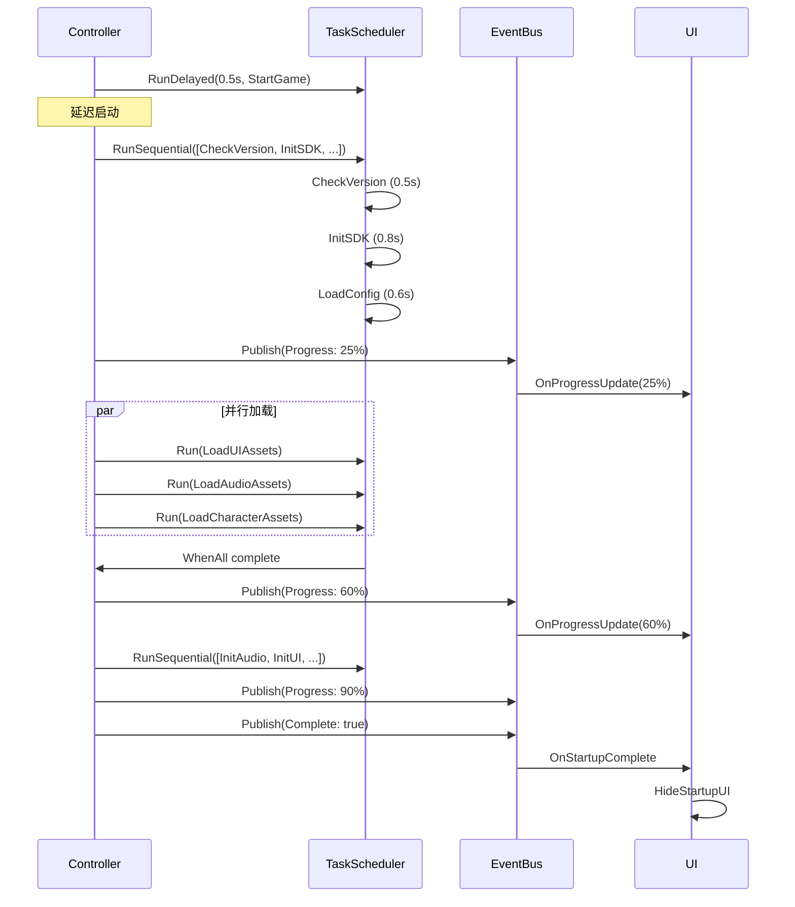

# TaskScheduler 实战案例：游戏启动流程

## 案例概述

本案例展示了如何使用 `TaskScheduler` 编排复杂的游戏启动流程，包括：
- ✅ 顺序执行（初始化任务必须按顺序）
- ✅ 并行执行（资源加载可以同时进行）
- ✅ 任务取消（支持中断启动流程）
- ✅ 进度追踪（通过 EventBus 发布进度事件）
- ✅ 异常处理（SDK 初始化失败等）

## 文件结构

```
Assets/Scripts/Runtime/Services/Startup/
├── GameStartupController.cs      # 启动控制器（核心逻辑）
├── StartupProgressUI.cs          # 进度 UI（订阅事件更新界面）
└── README_TaskScheduler案例.md   # 本文档
```

## 使用步骤

### 1. 场景配置

在启动场景中创建以下 GameObject：

```
Scene: LaunchScene
├── Bootstrapper (挂载 Bootstrapper.cs)
├── GameStartupController (挂载 GameStartupController.cs)
└── Canvas
    └── StartupProgressUI (挂载 StartupProgressUI.cs)
        ├── ProgressBar (Slider)
        ├── ProgressText (TextMeshProUGUI)
        ├── StatusText (TextMeshProUGUI)
        ├── TipText (TextMeshProUGUI)
        └── LoadingSpinner (GameObject)
```

### 2. Inspector 配置

**GameStartupController：**
- `Auto Start`: ✅ (自动启动)
- `Delay Start Seconds`: 0.5 (延迟 0.5 秒启动)

**StartupProgressUI：**
- 拖入对应的 UI 组件引用
- 配置 `Loading Tips` 数组

### 3. 运行场景

点击 Play，观察 Console 日志输出：

```
[GameStartup] ========== 游戏启动流程开始 ==========
[GameStartup] >>> 阶段 1：初始化阶段
[Task] 检查版本...
[Task] ✓ 版本检查完成
[Task] 初始化 SDK...
[Task] ✓ SDK 初始化完成
[Task] 加载游戏配置...
[Task] ✓ 游戏配置加载完成
[GameStartup] 进度：初始化完成 (25%)
[GameStartup] >>> 阶段 2：资源加载阶段
[Task] 加载 UI 资源...    ← 并行执行
[Task] 加载音频资源...    ← 并行执行
[Task] 加载角色资源...    ← 并行执行
[Task] ✓ 音频资源加载完成
[Task] ✓ UI 资源加载完成
[Task] ✓ 角色资源加载完成
[GameStartup] 进度：资源加载完成 (60%)
...
[GameStartup] ========== 游戏启动流程完成 ==========
```

## 核心代码解析

### 1. 顺序执行任务

```csharp
// 使用 RunSequential 按顺序执行多个任务
await _taskScheduler.RunSequential(new Func<CancellationToken, UniTask>[]
{
    async ct => await CheckVersion(ct),      // 第 1 步
    async ct => await InitializeSDK(ct),     // 第 2 步（依赖第 1 步）
    async ct => await LoadGameConfig(ct),    // 第 3 步（依赖第 2 步）
    async ct => await InitializeDatabase(ct) // 第 4 步（依赖第 3 步）
}, "InitializationPhase");
```

**特点：**
- 任务严格按顺序执行
- 前一个任务完成后才开始下一个
- 适合有依赖关系的任务

### 2. 并行执行任务

```csharp
// 同时启动多个任务
var tasks = new[]
{
    _taskScheduler.Run(async ct => await LoadUIAssets(ct), "LoadAssets_UI", ct),
    _taskScheduler.Run(async ct => await LoadAudioAssets(ct), "LoadAssets_Audio", ct),
    _taskScheduler.Run(async ct => await LoadCharacterAssets(ct), "LoadAssets_Character", ct)
};

// 等待所有任务完成
await UniTask.WhenAll(tasks);
```

**特点：**
- 任务同时执行，互不等待
- 节省总时间（3 个 1 秒任务只需 1 秒）
- 适合无依赖关系的任务

### 3. 延迟执行

```csharp
// 延迟 0.5 秒后启动
_taskScheduler.RunDelayed(TimeSpan.FromSeconds(delayStartSeconds), async ct =>
{
    await StartGameAsync(ct);
}, "DelayExecute_GameStart");
```

### 4. 任务取消

```csharp
// 保存任务 ID
_initTaskId = await _taskScheduler.RunSequential(...);

// 后续可以取消
_taskScheduler.CancelTask(_initTaskId);
```

### 5. 进度追踪

通过 `EventBus` 发布进度事件：

```csharp
// 发布进度
private void PublishProgress(string message, float progress)
{
    _eventBus.Publish(new GameStartupProgressEvent(message, progress));
}

// UI 订阅进度
_eventBus.Subscribe<GameStartupProgressEvent>(OnProgressUpdate)
    .AddTo(_disposables);
```

### 6. 异常处理

```csharp
try
{
    await ExecuteInitializationPhase(ct);
    await ExecuteLoadingPhase(ct);
}
catch (OperationCanceledException)
{
    LogManager.Warning(LogCategory.System, "启动流程被取消");
}
catch (Exception ex)
{
    LogManager.Error(LogCategory.System, $"启动失败: {ex.Message}");
}
```

## 启动流程时序图



## 性能对比

### 顺序执行 vs 并行执行

**假设单个任务耗时：**
- LoadUIAssets: 1.2 秒
- LoadAudioAssets: 1.0 秒
- LoadCharacterAssets: 1.5 秒

**顺序执行总耗时：** 1.2 + 1.0 + 1.5 = **3.7 秒**

**并行执行总耗时：** max(1.2, 1.0, 1.5) = **1.5 秒**

**性能提升：** 60% ⚡

## 扩展示例

### 1. 带超时的任务

```csharp
public async UniTask LoadWithTimeout(CancellationToken ct)
{
    var timeoutCts = new CancellationTokenSource(TimeSpan.FromSeconds(5));
    var linkedCts = CancellationTokenSource.CreateLinkedTokenSource(ct, timeoutCts.Token);
    
    try
    {
        await _taskScheduler.Run(async ct => 
        {
            await LoadSlowAsset(ct);
        }, "LoadAsset_WithTimeout", linkedCts.Token);
    }
    catch (OperationCanceledException)
    {
        if (timeoutCts.IsCancellationRequested)
        {
            LogManager.Error(LogCategory.System, "任务超时！");
        }
    }
    finally
    {
        timeoutCts.Dispose();
        linkedCts.Dispose();
    }
}
```

### 2. 重试机制

```csharp
public async UniTask LoadWithRetry(int maxRetries = 3)
{
    int attempt = 0;
    
    while (attempt < maxRetries)
    {
        try
        {
            await _taskScheduler.Run(async ct => 
            {
                await LoadUnstableAsset(ct);
            }, $"LoadAsset_Attempt{attempt + 1}");
            
            return; // 成功，退出重试
        }
        catch (Exception ex)
        {
            attempt++;
            LogManager.Warning(LogCategory.System, 
                $"加载失败 ({attempt}/{maxRetries}): {ex.Message}");
            
            if (attempt >= maxRetries)
            {
                throw; // 达到最大重试次数，抛出异常
            }
            
            // 延迟后重试
            await UniTask.Delay(1000);
        }
    }
}
```

### 3. 条件执行

```csharp
public async UniTask ConditionalLoad(bool needHeavyAssets)
{
    // 总是执行的任务
    await _taskScheduler.Run(async ct => await LoadBasicAssets(ct), "LoadBasicAssets");
    
    // 根据条件决定是否执行
    if (needHeavyAssets)
    {
        await _taskScheduler.Run(async ct => await LoadHeavyAssets(ct), "LoadHeavyAssets");
    }
}
```

## 调试技巧

### 1. 查看活跃任务数量

```csharp
Debug.Log($"当前活跃任务数: {_taskScheduler.ActiveTaskCount}");
```

### 2. 右键菜单调试

在 `GameStartupController` 上添加 `[ContextMenu]`：

```csharp
[ContextMenu("Start Game")]
public async void StartGameManually() { ... }

[ContextMenu("Cancel Startup")]
public void CancelStartup() { ... }
```

在 Inspector 中右键组件可直接调用。

### 3. 模拟失败场景

在任务中添加随机失败：

```csharp
if (UnityEngine.Random.value < 0.1f) // 10% 失败率
{
    throw new Exception("SDK 初始化失败");
}
```

## 常见问题

### Q1: 如何取消整个启动流程？

A: 使用同一个 `CancellationToken` 传递给所有子任务：

```csharp
private CancellationTokenSource _startupCts;

private async UniTask StartGameAsync()
{
    _startupCts = new CancellationTokenSource();
    
    try
    {
        await ExecuteInitializationPhase(_startupCts.Token);
        await ExecuteLoadingPhase(_startupCts.Token);
    }
    finally
    {
        _startupCts.Dispose();
    }
}

public void CancelStartup()
{
    _startupCts?.Cancel();
}
```

### Q2: 如何避免任务泄漏？

A: `TaskScheduler` 会自动清理完成的任务，但长时间运行的任务应：
1. 正确响应 `CancellationToken`
2. 在组件销毁时取消任务

### Q3: 如何在任务间传递数据？

A: 使用闭包捕获或返回值：

```csharp
var config = await _taskScheduler.Run(async ct => 
{
    var data = await LoadConfig(ct);
    return data; // 返回数据
}, "LoadConfig");

// 使用 config
await _taskScheduler.Run(async ct => 
{
    await UseConfig(config, ct); // 闭包捕获
}, "UseConfig");
```

## 总结

这个案例展示了：
- ✅ **顺序执行**：初始化阶段（依赖关系明确）
- ✅ **并行执行**：资源加载阶段（互不依赖）
- ✅ **延迟执行**：启动流程延迟
- ✅ **任务取消**：支持中断流程
- ✅ **进度追踪**：EventBus + UI 更新
- ✅ **异常处理**：try-catch + 重试机制

`TaskScheduler` 是一个强大的工具层组件，适合管理各种异步操作的执行、取消和等待。
